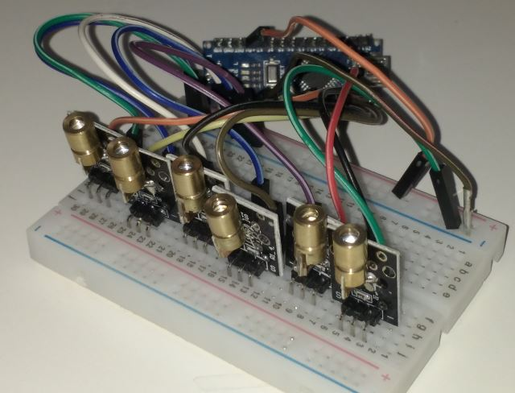

# Arduino-Nano-Laser-Demo
A simple example of using Arduino basic GPIO pin HIGH and LOW to switch on and off some cheap Chinese red lasers.

This demonstrates the most simple aspect of any microcontroller - being able to turn a pin ON (HIGH) or OFF (LOW).

However, in this sketch we  use PWM (Pulse Width Modulation) to do so. If this doesn't make any sense then use [google](https://www.youtube.com/watch?v=jQ3JHknsM4o).

This sketch is 'dumb' in that I manually wrote the code to be timed perfectly to the song track - there's no automatic detection of a beat etc. Audio is played from a Windows PC hooked up to the Arduino Nano. A script simply tells the Arduino to start firing the Lasers at the same time the Windows PC plays the music.

## What do I need for this Sketch?

* An Arduino Nano or a clone from Aliexpress
* 6 x [KY-008](https://www.aliexpress.com/item/32958918446.html?spm=a2g0o.productlist.0.0.2114433dzdxJAo&algo_pvid=827c0775-8b73-4343-adc7-57722133856a&algo_expid=827c0775-8b73-4343-adc7-57722133856a-0&btsid=7d404227-cdc3-4245-b7bf-49dab733760a&ws_ab_test=searchweb0_0,searchweb201602_8,searchweb201603_53) red lasers from Aliexpress. You can get 10 of these for about $4.
* A breadboard at least 10cm wide
* Bunch of hookup wires

## Why an Arduino Nano?
The Arduino Nano was used for this demonstration as it has 5 volt GPIO pins and the lasers are 5 volt as well - so easy to wire up. Also, the lasers consume about 10mw each, which is just under the Arduino Nano's per-GPIO pin tolerance of about 20mW.

For the Arduino Nano GPIO pins 3, 5, 6, 9, 10, 11 are the only PWM capable pins. 

## How to run

1. Upload the sketch to the Arduino Nano
2. Wire up the 'S' pin on each of the  KY-008's to a respective PWM GPIO pin on the Arduino Nano (pins 3, 5, 6, 9, 10, 11)
3. Wire the '-' GND on each KY-008 to a common ground line on the breadboard.
4. Use windows powershell to run the 'PlayBeat1.ps1' - ensure that the Serial port configured in the script is correct for your Nano.
5. Also ensure you have a copy of the .wav file in a place and update the powershell script accordingly. Download the example .wav [here](http://tty0.uk.to/github/KipodBeat1.wav).

